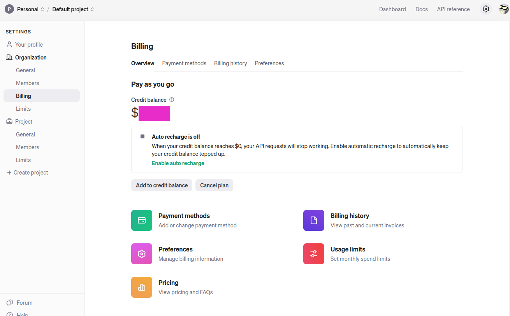
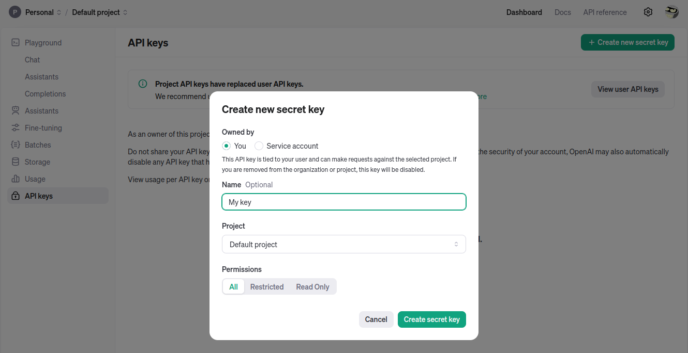
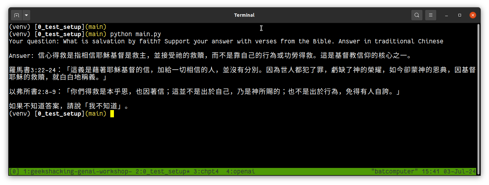
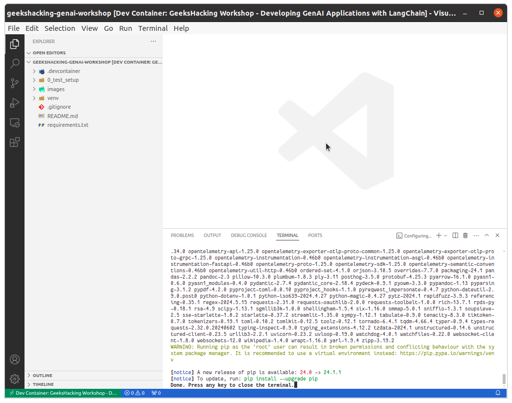
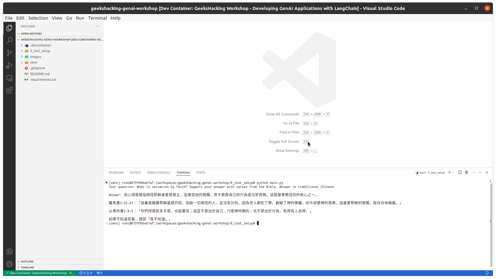

# <font color="red">__IMPORTANT__</font> Please complete the setup <ins>before</ins> you attend the workshop.

# [0] Pre-requisite

- Notebook, not table, with a minimum of 4 CPUs and 8 GB of memory
- Python 3.11 installed on your notebook and a Python package manager like [Conda](https://docs.conda.io/en/latest/) or [virtual environment](https://docs.python.org/3/library/venv.html).
- An IDE or code editor of your choice with Python syntax highlighting and LSP support. The workshop will be conducted using [Visual Studio Code (VSC)](https://code.visualstudio.com/download). If you are using Visual Studio Code install the following extension
  - [VSC extension - Microsoft Python](https://marketplace.visualstudio.com/items?itemName=ms-python.python)
- You should also have Git installed
- **ALTERNATIVE** - If you are familiar with [DevContainers](https://code.visualstudio.com/docs/devcontainers/containers) and would like to use it for this workshop, please install the following:
  - [Docker](https://docs.docker.com/engine/install/)
  - [VSC extension - Remote Explorer](https://marketplace.visualstudio.com/items?itemName=ms-vscode.remote-explorer)
  - [VSC extension - DevContainers](https://marketplace.visualstudio.com/items?itemName=ms-vscode-remote.remote-containers)

# [1] Create OpenAI Platform Account

## [1.1] Add Credit 
Create an [OpenAI](https://platform.openai.com) account. After your account has been created, you will now need to add USD$5 your account. Click on the gear icon on the top menu bar. This will bring you to the `Settings` page. From the left menu bar, click on `Billing`. The `Billing` page is shown below.



Click on `Add to credit balance` which brings up the `Add to credit balance` dialog box. Add your payment method and enter a minimum of USD$5. Once you have confirmed the payment, the billing page will display the amount you have entered.

## [1.2] Generate an OpenAI Secret Key
Click on `Dashboard` on the top menu bar. Click on `API keys` to create a new secret key as shown below. 



After you have generated your key, keep a copy of the key. <ins><strong>You will not be able to view the key again once you dismissed the dialog</strong></ins>.


# [2] Setup the Workshop's Environment

This is a [template repository](https://docs.github.com/en/repositories/creating-and-managing-repositories/creating-a-template-repository). Clone it to create your own repository based on this template.

You will now need to select _ONE_ of the following methods for running the workshop; either directly on your notebook or in a container. 

If you are running the workshop locally, then perform step [[2.1] Notebook Setup](#local); otherwise setup according to [[2.3] DevContainer Setup](#devcontainer).  The advantage of running in a container is that there are no Python installation on your notebook.


## <a id="local"></a>[2.1] Notebook Setup


Open a terminal and to create and activate your environment, eg. for Conda, 

```
conda create geekshacking-workshop
conda activate geekshacking-workshop 
```

Once the environment has been activated, install the packages from the `requirements.txt` file eg. 

```
pip install -r requirements.txt
```

Depending on your notebook and your network throughput, this can be anywhere from 5 to 20 minutes.

After you have successfully installed all the packages, test your environment. Open a terminal, if you have not done so. For Windows user, use the `cmd` rather than `PowerShell`. 

## <a id="test"></a>[2.2] Test OpenAI Secret Key
Set the environment variable `OPENAI_API_KEY` to your OpenAI key that you have generated in step [1.2].

For Windows (case sensitive)
```
set OPENAI_API_KEY=_secret_key_
```

For Linux and OSX (case sensitive)
```
export OPENAI_API_KEY='_secret_key_'
```

After setting the keys, change directory into `0_test_setup` directory and run `main.py`.
```
## Linux and OSX
export OPENAI_API_KEY='_secret_key_'
## Windows
set OPENAI_API_KEY=_secret_key_

cd 0_test_setup
python main.py
```

If you see the following output, the you have successfully setup your environment.



# <a id="devcontainer"></a>[2.3] ALTERNATIVE - Setup DevContainer

If you are using DevContainer, then open this repository in VSC after install all the required pre-requisites from step [0]. VSC will setup the Python environment and installed all the required packages. This can take about 5 to 20 minutes.



Open a terminal from within VSC, choose `cmd` for Windows, and perform the OpenAI test as described in step [[2.2]](#test) above.




